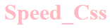

# Pourquoi utiliser speed css ?
Pour coder rapidement tout en personalisant son contenu.

----------------------------------------------------------------------
# !!!Nous travaillons qu'avec des classes!!!
Dans chaque projet tout est paramétrer pour avoir la structure suivante dans chaque page html

body
    header //Qui va contenir les menus
    content // Qui va contenir tous les éléments de notre site
    footer // Qui va contenir les mentions, réseaux sociaux etc..

Pour connecter "Speed Css" à son projet: 

On inclus dans le head config.css:
```
<link rel="stylesheet" href="public/assets/css/config.css">
```

Si vous voulez rajouter du css personnel , vous pourrez rajouter un main.css ou style.css

----------------------------------------------------------------------
# Comment espacer ou positionner des éléments?

space_1 : Permets d'espacer des éléments autour.

space_2 : Permets de espacer des éléments mais 2 collés aux extrémités.

col     : Permets de mettre des éléments en colone

center  : Permets de centrer un élément

float_r : Permets de déplacer un élément tout à droite

----------------------------------------------------------------------
# Comment mettre de la couleur en arrière plan ?

back_red    : Permets de mettre l'arrière plan en rouge.

back_blue   : Permets de mettre l'arrière plan en bleu.

back_green  : Permets de mettre l'arrière plan en vert.

back_yellow : Permets de mettre l'arrière plan en jaune.

back_orange : Permets de mettre l'arrière plan en orange.

back_black  : Permets de mettre l'arrière plan en black.

back_grey   : Permets de mettre l'arrière plan en gris.

back_purple : Permets de mettre l'arrière plan en violet.

back_pink   : Permets de mettre l'arrière plan en rose.

back_brown  : Permets de mettre l'arrière plan en marron.

back_white  : Permets de mettre l'arrière plan en blanc.

----------------------------------------------------------------------
# Comment mettre de la couleur dans son texte ?

txt_red    : Permets de mettre le texte en rouge.

txt_blue   : Permets de mettre le texte en bleu.

txt_green  : Permets de mettre le texte en vert.

txt_yellow : Permets de mettre le texte en jaune.

txt_orange : Permets de mettre le texte en orange.

txt_black  : Permets de mettre le texte en black.

txt_grey   : Permets de mettre le texte en gris.

txt_purple : Permets de mettre le texte en violet.

txt_pink   : Permets de mettre le texte en rose.

txt_brown  : Permets de mettre le texte en marron.

txt_white  : Permets de mettre le texte en blanc.

----------------------------------------------------------------------
# Comment mettre de la couleur dans son texte ?

txt_center  : Permets de centrer un texte.

txt_size5   : Permets de modifier la taille d'un texte. (txt_size + valeur) 5,10,15,20,25,30

----------------------------------------------------------------------
## Comment changer la hauteur ou la largeur d'un élément?

w | h | vh  + valeur

exemple: w100 = width: 100%;

exemple: h100 = height: 100%;

Il existe que 100vh pour le moment en valeur

exemple: vh100 = height: 100vh;

----------------------------------------------------------------------
## Comment mettre de la marge sur mes éléments sur la partie extérieure ?

mrg + valeur + option

Liste des options:

_l = left

_r = right

_t = top

_b = bottom

Exemple: mrg100_l = margin-left: 100%;

----------------------------------------------------------------------
## Comment mettre de la marge sur mes éléments sur la partie intérieure ?

pad + valeur + option

Liste des options:

_l = left

_r = right

_t = top

_b = bottom

Exemple: pad100_l = padding-left: 100%;

----------------------------------------------------------------------
# Comment arrondir les bords ou tout le boutton ?

btn_1 = border-radius: 10px; | Arrondis les bords du boutton

btn_2 = border-radius: 50%;  | Fais une boule 